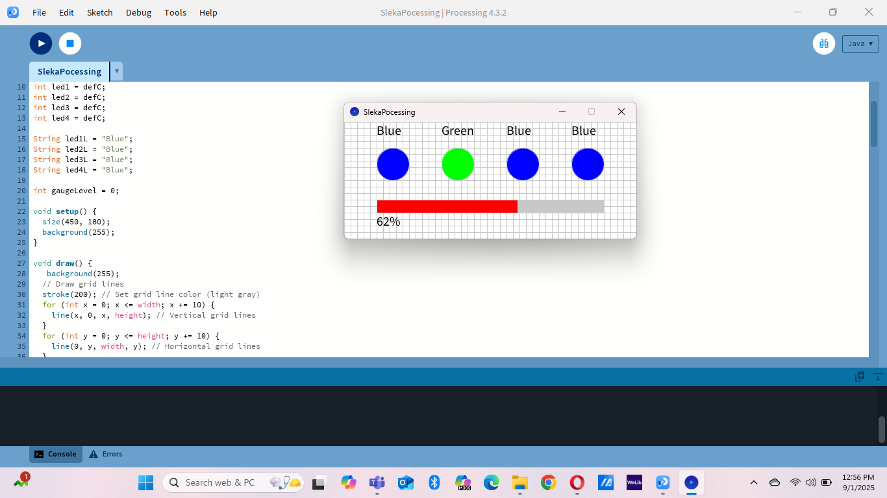
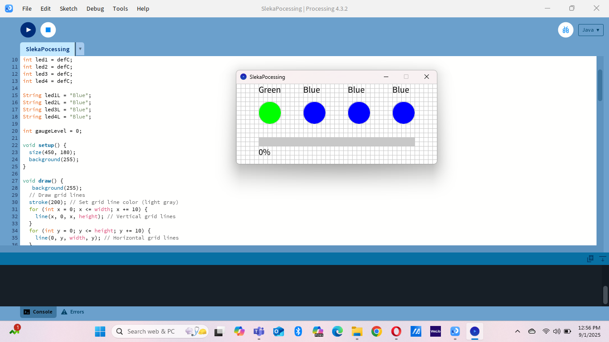
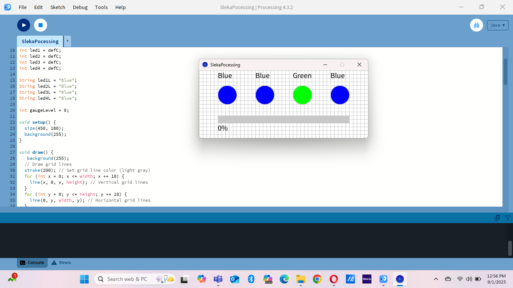
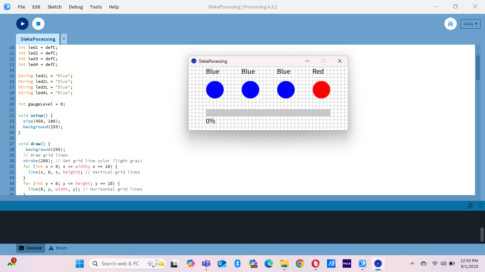
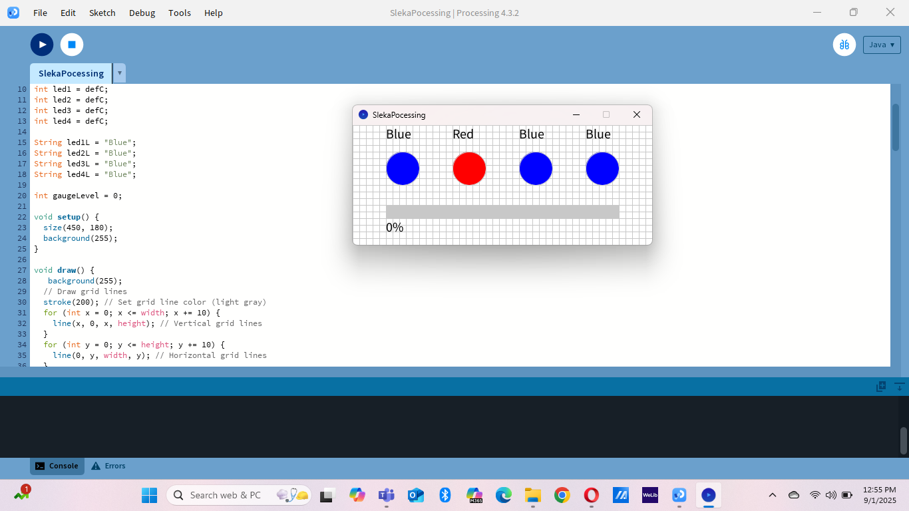
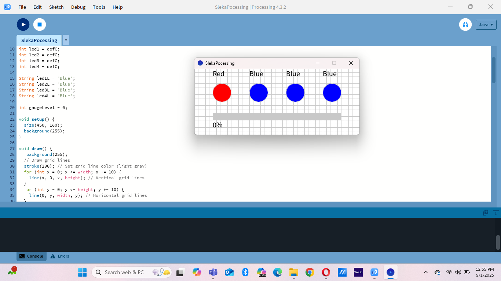
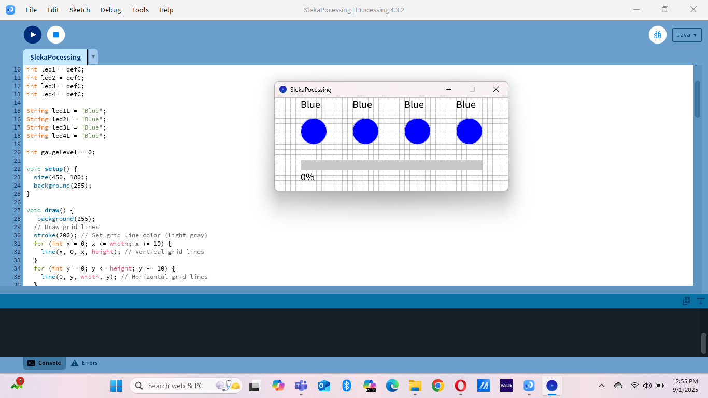

# 💡 Processing LED Gauge Practical

This Processing sketch simulates 4 LEDs and a gauge bar with interactive mouse and keyboard controls.  

## 🎮 Controls
- **Left click** → Turn selected LED **Red**  
- **Right click** → Turn selected LED **Green**  
- **← Arrow** → Decrease gauge level  
- **→ Arrow** → Increase gauge level  

---

## 📸 Screenshots

| Pic 1 | Pic 2 | Pic 3 |
|-------|-------|-------|
|  |  |  |

| Pic 4 | Pic 5 | Pic 6 |
|-------|-------|-------|
|  |  |  |

| Pic 7 | Pic 8 | Pic 9 |
|-------|-------|-------|
|  |  |  |

---

## ▶️ How to Run
1. Download and install [Processing](https://processing.org/).  
2. Clone this repo:
   ```bash
   git clone https://github.com/your-username/Processing-LED-Practical.git
